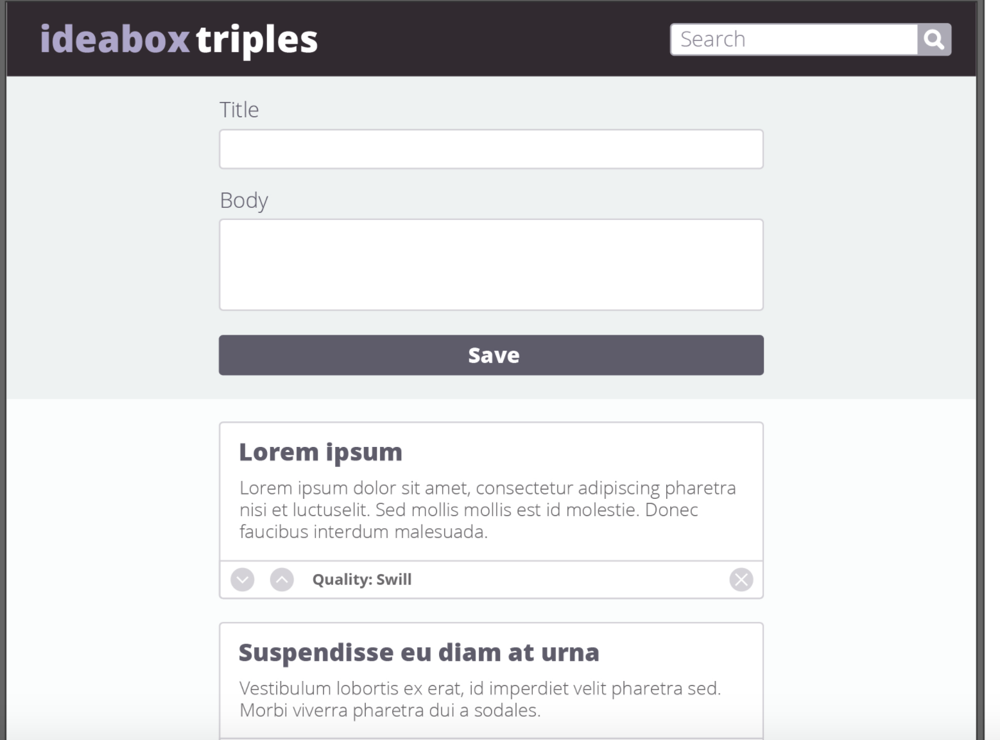
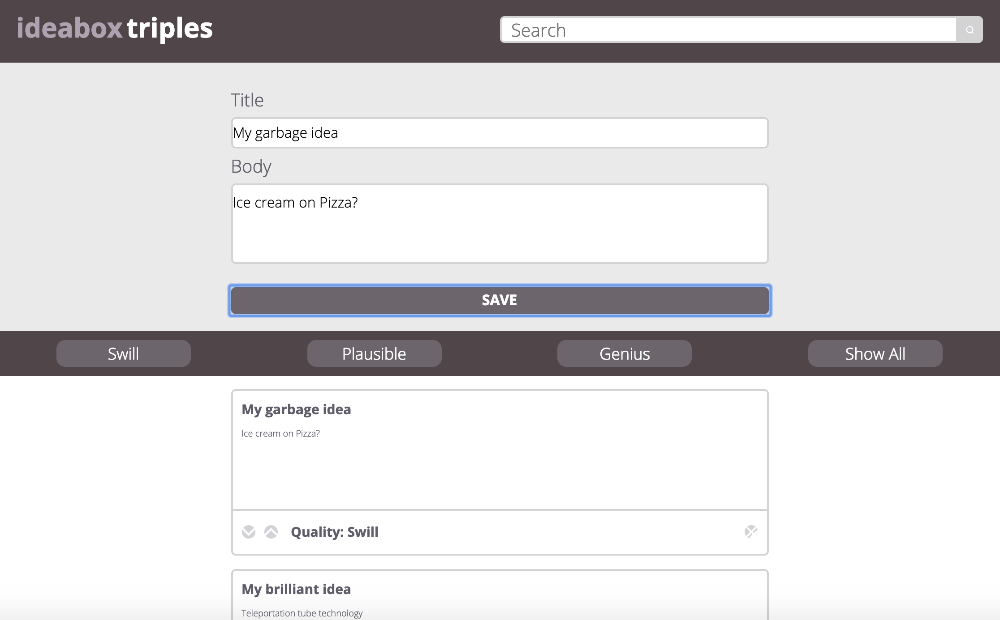

# Ideabox
### By Mason, Rachael, Duy

This was a group project completed for Turing school Mod 1. For this project, we were given a website comp to recreate with Javascript functionality. In this project, we were asked to put some of our new knowledge of local storage to use. The website allows a user to record their ideas, saving them to local storage, and allows them to filter their saved ideas by 'quality'. We were also challenged to create a button that removes the idea from the page and local storage, as well as add some functionality, such as editable text and controling the amount of ideas that appear on the page.
## What We gained from this project
In making this site, we bolstered our knowledge of local storage, and learned a lot about working with a team. The experience using gitHub and Slack to communicate about ideas and tasks to be completed will help us as we all hope to work with teams in the future. While there are still a few pieces we wish we figured out, as we continue to get more comfortable with JS and local storage/JSON, we hope to come back to this and improve the overall functionality.
### Screenshots
Here is the design we were asked to recreate:

Here is ours- we added a button row to allow the user to filter ideas:

Here is our responsive site:

